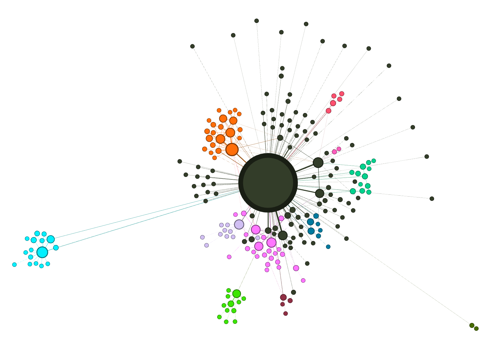

# 知识图谱构建
- **gpt-4-turbo(💰 1.76 USD)**
- **gpt-4o-mini(💰 0.09 USD)**
- **deepseek(💰 0.47 CNY)**
```bash
graphrag index --root ./ragtest
```

# 问答
## 全局问题：What are the top themes in this story?
- **gpt-4-turbo(💰 0.11 USD)**
- **gpt-4o(💰 <0.01 USD)**
- **deepseek(💰 约0.02 CNY)**
```bash
graphrag query \
--root ./ragtest \
--method global \
--query "What are the top themes in this story?"
```

```md
SUCCESS: Global Search Response:
### Top Themes in the Story

The story in question delves deeply into several universal themes, each contributing to the narrative's lasting impact and relevance. Below, we explore the most significant themes as identified through the analysis of pertinent data.

#### Transformation and Redemption

Central to the narrative is the theme of transformation and redemption, vividly portrayed through the character arc of Ebenezer Scrooge. Initially depicted as a miser, Scrooge undergoes a profound change, emerging as a figure of generosity. This transformation is catalyzed by his encounters with the spirits of Christmas, which serve as a powerful narrative device to explore the possibility of redemption [Data: Reports (1)].

#### Compassion and Empathy

The importance of compassion and empathy is another dominant theme, highlighted through Scrooge's interactions with the Ghosts of Christmas. These supernatural encounters inspire a radical shift in Scrooge's behavior, particularly in his treatment of the Cratchit family. The narrative uses these changes to underscore the impact of empathy and compassion on human relationships [Data: Reports (1, 5)].

#### Impact of Individual Actions

Closely related to the themes of compassion and empathy is the emphasis on the impact of individual actions on the well-being of others. Scrooge's newfound generosity towards the Cratchit family and his broader community exemplifies how personal transformation can lead to positive societal change. This theme reinforces the narrative's message about the importance of individual responsibility in fostering community welfare [Data: Reports (1)].

#### Universal Celebration of Christmas

The story also explores the universal celebration of Christmas, portraying it as a time of joy, warmth, and community. Through vignettes of miners, lighthouse keepers, and sailors, the narrative demonstrates the widespread influence of the holiday's spirit, suggesting a collective human capacity for celebration and kindness [Data: Reports (5)].

#### Role of Supernatural Elements

Finally, the role of supernatural elements in facilitating personal growth and moral lessons is a key theme. The spirits of Christmas and the ghost of Jacob Marley are instrumental in guiding Scrooge on his journey towards self-improvement and moral enlightenment. These elements highlight the narrative's use of the supernatural to convey its moral and ethical messages [Data: Reports (1, 6)].

### Conclusion

In summary, the story weaves together themes of transformation and redemption, compassion and empathy, the impact of individual actions, the universal celebration of Christmas, and the role of supernatural elements. Each theme contributes to the narrative's exploration of human nature and morality, offering insights that remain relevant and resonant.
```

## 本地问题：Who is Scrooge and what are his main relationships?
- **gpt-4o-mini（💰 <0.01 USD）：**
- **deepseek(💰 约0.01 CNY)**
```bash
graphrag query \
--root ./ragtest \
--method local \
--query "Who is Scrooge and what are his main relationships?"
```
```md
SUCCESS: Local Search Response:
## Who is Scrooge?

Scrooge is a central character in Charles Dickens' novella "A Christmas Carol." Initially portrayed as a miserly and cold-hearted man, he is known for his disdain for Christmas and his lack of compassion towards others. Scrooge's transformation begins when he is visited by the ghost of his former business partner, Jacob Marley, who warns him about the consequences of his selfish life. Following this, Scrooge encounters three spirits—the Ghost of Christmas Past, the Ghost of Christmas Present, and the Ghost of Christmas Yet to Come—who guide him through a journey of self-reflection and moral awakening. By the end of the story, Scrooge undergoes a profound change, embracing the spirit of Christmas and demonstrating generosity and kindness towards those around him [Data: Entities (0); Relationships (0, 1, 2, 3, 4, 5, 6, 8, 10, 14, 19, 20, 24, +more)].

## Main Relationships

Scrooge's relationships are pivotal to his character development and transformation throughout the story. Here are some of the key relationships:

1. **Scrooge's Nephew (Fred)**: Fred is Scrooge's cheerful and optimistic nephew who consistently invites Scrooge to Christmas dinner, hoping to rekindle their familial bond. Despite Scrooge's initial refusals, Fred's persistence highlights the importance of family and connection [Data: Entities (14, 50); Relationships (9, 24)].

2. **Bob Cratchit**: Bob is Scrooge's underpaid and overworked employee. Despite Scrooge's harsh treatment, Bob remains respectful and patient. Scrooge's transformation is notably marked by his decision to raise Bob's salary and provide for his family, showcasing a newfound generosity [Data: Entities (45); Relationships (20)].

3. **Jacob Marley**: Marley's ghost serves as a catalyst for Scrooge's change. He warns Scrooge about the consequences of his miserly ways and introduces the idea of redemption through the visits of the three spirits [Data: Entities (1, 42); Relationships (0, 16)].

4. **The Spirits**: The three spirits—Ghost of Christmas Past, Ghost of Christmas Present, and Ghost of Christmas Yet to Come—play crucial roles in guiding Scrooge through his journey of self-discovery. Each spirit reveals different aspects of his life, prompting him to reflect on his past, understand the present, and consider the future [Data: Entities (4, 10, 31, 40); Relationships (1, 11, 14, 18)].

5. **Fan**: Scrooge's sister, Fan, represents a lost connection to his childhood and the warmth of family. Her visit in the past evokes feelings of nostalgia and regret in Scrooge, reminding him of the love he once had [Data: Entities (11); Relationships (6, 32)].

Through these relationships, Scrooge's character evolves from a solitary miser to a beloved figure who embodies the spirit of Christmas, emphasizing themes of redemption, compassion, and the importance of human connections [Data: Entities (0); Relationships (19, 20, 24, +more)].
```

# KG可视化
merged_graph.graphml在Gephi上长这样：
